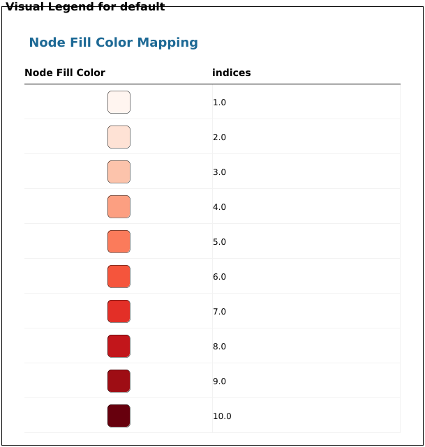

# Purpose

This vignette shows one way to visualize networks retrieved using paxtoolsr [@luna_paxtoolsr:_2015] in Cytoscape [@shannon_cytoscape:_2003 ; @ono_cyrest:_2015] using RCy3. Paxtoolsr leverages tools developped in the java toolkit paxtools to retrieve information from Pathway commons. For example you can retrieve a network or subnetwork related to a particular pathway. For more information please see @luna_paxtoolsr:_2015 and have a look at the paxtoolsr package vignette:

```
library(paxtoolsr)
browseVignettes("paxtoolsr")
```
In this vignette we will visualize a network retrieved from Pathway Commons, query Pathway commons to find the neighbourhood of a specific gene, look at a subnetwork of a set of proteins, and visualize node metadata associated with the networks. 

To get started, load packages for use in this tutorial
```{r, eval=FALSE, message = FALSE}
library(paxtoolsr)
library(RCy3)
library(igraph)
library(RColorBrewer)
```

# Visualize a network using paxtoolsr

We will use paxtoolsr to convert a metabolic pathway file (installed with paxtoolsr) to the Simple Interaction Format (SIF). 
```{r, eval=FALSE}
sif <- paxtoolsr::toSif(system.file("extdata",
                         "biopax3-short-metabolic-pathway.owl",
                         package = "paxtoolsr"))
```

We will use igraph to create a network from the SIF file and then convert that to node and edge lists that can be sent to Cytoscape via RCy3. 

```{r, eval=FALSE}
g <- igraph::graph.edgelist(as.matrix(sif[, c(1, 3)]),
                    directed = FALSE)

g.nodes <- as.data.frame(igraph::vertex.attributes(g))
g.edges <- data.frame(igraph::as_edgelist(g))
names(g.edges) <- c("name.1",
                    "name.2")

ug <- cyPlot(g.nodes,
             g.edges)
```

## Send network to Cytoscape using RCy3

To run this example **Cytoscape software must be running**. In Cytoscape we will also need Allegro-plugin for this example. 

To begin we create a connection in R that we can use to manipulate the networks and then we will delete any windows that were already in Cytoscape so that we don't use up all of our memory. 

```{r, eval=FALSE, message=FALSE}
cy <- CytoscapeConnection()
deleteAllWindows(cy)
```

```{r, eval=FALSE, message=FALSE}
cw <- CytoscapeWindow("Metabolic pathway from paxtoolsr",
                      graph = ug,
                      overwriteWindow = TRUE)
setDefaultNodeFontSize(cw,
                       7)
```

```{r, eval=FALSE, message=FALSE, results="hide"}
displayGraph(cw)
layoutNetwork(cw,
              "force-directed")
fitContent(cw)
```

```{r, eval=FALSE, echo=FALSE}
Sys.sleep(10)
saveImage(cw,
          "paxtools_met_path_1",
          "png",
          h = 700)
knitr::include_graphics("./paxtools_met_path_1.png")
```

# Pathway Commons Graph Query

Paxtoolsr can also be used to query Pathway Commons for the neighbours of a particular gene. In this case we will examine the gene neighbourhood of gene Brain-derived neurotrophic factor(BDNF) which is involved in neuron growth and survival. 

```{r, eval=FALSE}
gene <- "BDNF"
t1 <- paxtoolsr::graphPc(source = gene,
              kind = "neighborhood",
              format = "BINARY_SIF",
              verbose = TRUE)
```

For our network we only want to visualize interaction where BDNF controls a reactions that changes the state of the second protein ("controls-state-change-of", see more info on the binary relations in Pathway commons [here](http://www.pathwaycommons.org/pc2/formats)).  


```{r, eval= FALSE}
t2 <- t1[which(t1[, 2] == "controls-state-change-of"), ]
```

For our example we only want to use a small number of interactions so we will use `filterSIF()` to reduce the number visualized.

```{r, eval=FALSE}
ids <- unique(c(t2$PARTICIPANT_A,
                t2$PARTICIPANT_B))
t3 <- paxtoolsr::filterSif(t2,
                ids = sample(ids,
                             25))
```

We will use this filtered dataframe to create a network using igraph's `graph.edgelist()`

```{r, eval=FALSE}
g <- igraph::graph.edgelist(as.matrix(t3[, c(1, 3)]),
                    directed = FALSE)
```

Format the graph for sending to Cytoscape.

```{r, eval=FALSE}
g.nodes <- as.data.frame(igraph::vertex.attributes(g))
g.edges <- data.frame(igraph::as_edgelist(g))
names(g.edges) <- c("name.1",
                    "name.2")

ug <- cyPlot(g.nodes,
             g.edges)
```

## Send network to Cytoscape using RCy3

Reset the default node size
```{r, eval=FALSE}
setDefaultNodeFontSize(cw,
                       12)
```


```{r, eval=FALSE, message=FALSE}
cw <- CytoscapeWindow("Pathway Commons graph query from paxtoolsr",
                      graph = ug,
                      overwriteWindow = TRUE)
```

```{r, eval=FALSE, message=FALSE, results="hide"}
displayGraph(cw)
# setLayoutProperties(cw,
#                     layout.name = "allegro-spring-electric",
#                     list(gravity = 100,
#                          scale = 6))
layoutNetwork(cw,
              layout.name = "force-directed")
fitContent(cw)
```

```{r, eval=FALSE, echo=FALSE}
Sys.sleep(10)
saveImage(cw,
          "pathway_commons_gq",
          "png",
          h = 700)
knitr::include_graphics("./pathway_commons_gq.png")
```

# Create a subnetwork from a set of proteins

We will examine a network composed of the genes AKT serine/threonine kinase 1 ("AKT1"), Insulin receptor substrate 1 ("IRS1"), mechanistic target of rapamycin ("MTOR") and Insulin Like Growth Factor 1 Receptor ("IGF1R"). The paths betwen these genes can represent metabolic and signaling pathways, molecular and genetic interactions or gene regulation.

```{r, eval=FALSE}
genes <- c("AKT1",
           "IRS1",
           "MTOR",
           "IGF1R")
t1 <- paxtoolsr::graphPc(source = genes,
              kind = "PATHSBETWEEN",
              format = "BINARY_SIF", 
              verbose = TRUE)
```

We will again filter our network to visualize interactions where the genes control a reactions that changes the state of the second gene protein ("controls-state-change-of", see more info [here](http://www.pathwaycommons.org/pc2/formats)).  

```{r, eval=FALSE}
t2 <- t1[which(t1[, 2] == "controls-state-change-of"),]
```

Create graph using igraph.

```{r, eval=FALSE}
g <- igraph::graph.edgelist(as.matrix(t2[, c(1, 3)]),
                    directed = FALSE)
```

Convert graph to node and edges lists to send to Cytoscape.

```{r, eval=FALSE}
g.nodes <- as.data.frame(igraph::vertex.attributes(g))
g.edges <- data.frame(igraph::as_edgelist(g))
names(g.edges) <- c("name.1",
                    "name.2")

ug <- cyPlot(g.nodes,
             g.edges)
```

## Send network to Cytoscape using RCy3

```{r, eval=FALSE, message=FALSE}
cw <- CytoscapeWindow("Subnetwork of Pathway Commons graph query from paxtoolsr",
                      graph = ug,
                      overwriteWindow = TRUE)
```

```{r, eval=FALSE, message=FALSE, results="hide"}
displayGraph(cw)
layoutNetwork(cw,
              layout.name = "force-directed")
```

```{r, eval=FALSE, echo=FALSE}
fitContent(cw)
Sys.sleep(10)
saveImage(cw,
          "subnet_pathway_commons_gq",
          "png",
          h = 700)
knitr::include_graphics("./subnet_pathway_commons_gq.png")
```

# Adding metadata to Pathway commons networks

It can be useful to overlay data from experiments or other sources onto the nodes and edges of a network. We will do this by simulating some data that will be used to colour the nodes of the network. 

```{r, eval=FALSE}
# Generate a color palette that goes from white to red 
# that contains 10 colours
numColors <- 10
colors <- colorRampPalette(RColorBrewer::brewer.pal(9, "Reds"))(numColors)

# Generate values that could represent some experimental values
values <- runif(length(V(g)$name))

# Scale values to generate indices from the color palette
xrange <- range(values)
newrange <- c(1,
              numColors)

factor <- (newrange[2] - newrange[1])/(xrange[2] - xrange[1])
scaledValues <- newrange[1] + (values - xrange[1]) * factor
indices <- as.integer(scaledValues)
```

After the colours and values for the nodes have been generated, we will add this information to the network that we used in the previous section.

```{r, eval=FALSE}
g <- cw@graph   
g <- initNodeAttribute(graph = g,
                       'indices',
                       "numeric",
                       0)
nodeData(g, nodes(g), "indices") <- indices
```

```{r, eval=FALSE, message = FALSE}
cw <- CytoscapeWindow("Coloured network paxtoolsr",
                      graph = g,
                      overwriteWindow = TRUE)
displayGraph(cw) # cw's graph is sent to Cytoscape
```


## Send network to Cytoscape using RCy3

```{r, eval=FALSE, message=FALSE, results="hide"}
displayGraph(cw)
fitContent(cw)
```

Now use the information contained in the "indices" column to add the colours to the nodes in Cytoscape. 

```{r, eval=FALSE}
layoutNetwork(cw,
              layout.name = "force-directed")
setNodeColorRule(cw,
                 "indices",
                 control.points = as.numeric(c(1.0:10.0)), # needs to match type of column in Cytoscape
                 colors,
                 "lookup",
                 default.color="#ffffff")

```

```{r, eval=FALSE, echo=FALSE}
fitContent(cw)
Sys.sleep(10)
saveImage(cw,
          "coloured_paxtoolsr_ex",
          "png",
          h = 700)

knitr::include_graphics("./coloured_paxtoolsr_ex.png")

```


# References
